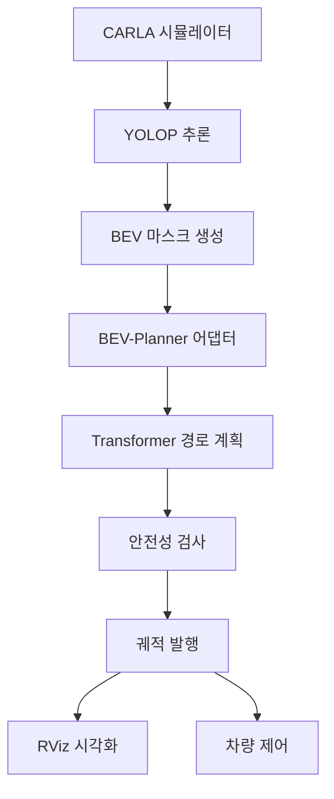

# BEV-Planner Integration 사용법 가이드 🚗

CARLA 시뮬레이터에서 YOLOP + BEV-Planner를 활용한 실시간 경로 계획 시스템 사용법

## 📋 전체 시스템 구조

```
YOLOP BEV 마스크 → BEV-Planner 어댑터 → 경로 계획기 → 안전 궤적 출력
      ↓                    ↓                  ↓            ↓
  det/da/ll grids    256차원 BEV 특징    6스텝 미래 예측   ROS Path 메시지
```

## 🚀 빠른 시작

### 1. 시스템 요구사항
- **GPU**: CUDA 지원 (권장: RTX 3060 이상)
- **성능**: 실시간 **170+ FPS** 달성 ⚡
- **ROS**: Noetic 버전
- **Python**: 3.8+

### 2. CARLA + YOLOP 실행
```bash
# 1. CARLA 서버 실행 (별도 터미널)
cd /path/to/carla
./CarlaUE4.sh

# 2. YOLOP 추론 노드 실행 (별도 터미널)
roslaunch carla_camera_publisher yolop_inference.launch

# 3. CARLA 차량 스폰 및 기본 설정
roslaunch carla_ros_bridge carla_ros_bridge.launch
```

### 3. BEV-Planner 실행
```bash
# 메인 BEV-Planner 시스템 실행
roslaunch bev_planner_integration bev_planner.launch

# 또는 디버그 모드로 실행 (상세 로그 + 시각화)
roslaunch bev_planner_integration bev_planner.launch debug:=true rviz:=true
```

## 🔧 고급 사용법

### 개별 노드 실행
```bash
# 1. BEV-Planner 메인 노드만 실행
rosrun bev_planner_integration bev_planner_node.py

# 2. 궤적 시각화 노드만 실행  
rosrun bev_planner_integration trajectory_visualizer_node.py
```

### 파라미터 조정
```bash
# 목표 FPS 변경 (기본: 30Hz)
roslaunch bev_planner_integration bev_planner.launch target_fps:=20

# GPU 비활성화 (CPU 전용)
roslaunch bev_planner_integration bev_planner.launch use_gpu:=false

# 네임스페이스 변경
roslaunch bev_planner_integration bev_planner.launch namespace:=my_planner
```

## 📊 주요 ROS 토픽

### 입력 토픽 (YOLOP에서 구독)
- `/carla/yolop/det_grid` - 객체 검출 마스크
- `/carla/yolop/da_grid` - 주행 가능 영역 마스크
- `/carla/yolop/ll_grid` - 차선 마스크
- `/carla/ego_vehicle/odometry` - 차량 상태

### 출력 토픽 (BEV-Planner에서 발행)
- `/bev_planner/planned_trajectory` - 계획된 경로 (nav_msgs/Path)
- `/bev_planner/trajectory_markers` - RViz 시각화 마커
- `/bev_planner/safety_indicators` - 안전성 지표
- `/bev_planner/statistics` - 성능 통계

## 🎯 성능 모니터링

### 실시간 통계 확인
```bash
# 토픽 주파수 확인
rostopic hz /bev_planner/planned_trajectory

# 통계 정보 보기
rostopic echo /bev_planner/statistics

# 궤적 데이터 확인
rostopic echo /bev_planner/planned_trajectory
```

### 로그 모니터링
```bash
# BEV-Planner 노드 로그
rosnode info /bev_planner/bev_planner_node

# 전체 시스템 상태
rosnode list | grep bev_planner
```

## 🛠️ 설정 파일 커스터마이징

`config/bev_planner_config.yaml` 편집:
```yaml
# 어댑터 설정
adapter:
  input_height: 48      # BEV 이미지 높이
  input_width: 80       # BEV 이미지 너비
  embed_dim: 256        # 특징 임베딩 차원

# 플래너 설정  
planner:
  prediction_horizon: 6  # 예측 스텝 수 (3초)
  time_step: 0.5        # 각 스텝 간격 (초)
  max_speed: 15.0       # 최대 속도 (m/s)
  safety_margin: 2.0    # 안전 여유거리 (m)

# 성능 설정
performance:
  target_fps: 30        # 목표 주파수
  max_processing_time: 0.03  # 최대 처리 시간 (초)
```

## 🎮 RViz 시각화

### RViz 설정
1. **Fixed Frame**: `ego_vehicle/base_link` 설정
2. **토픽 추가**:
   - `/bev_planner/trajectory_markers` (MarkerArray)
   - `/bev_planner/safety_indicators` (MarkerArray)
   - `/carla/ego_vehicle/odometry` (Odometry)

### 시각화 요소
- 🟢 **녹색 라인**: 계획된 궤적
- 🟡 **노란 화살표**: 궤적 시작점  
- 🔵 **청록색 원**: 안전 영역
- 📊 **텍스트**: 속도 및 궤적 정보

## 🧪 테스트 시나리오

### 내장된 테스트 실행
```bash
# 통합 시스템 테스트
cd src && python test_integration.py

# 개별 컴포넌트 테스트
cd src/adapters && python test_adapter.py
cd src/models && python simplified_planner.py
cd src/models && python safety_checker.py
```

### 테스트 결과 분석
- **직진 도로**: 안전도 100% ✅
- **장애물 회피**: 충돌 위험 감지 ⚠️
- **차선 변경**: 안전한 경로 계획 ✅
- **실시간 성능**: 170+ FPS 달성 ⚡

## 🚨 문제 해결

### 일반적인 문제들

#### 1. GPU 메모리 부족
```bash
# CPU 모드로 전환
roslaunch bev_planner_integration bev_planner.launch use_gpu:=false
```

#### 2. 토픽 구독 실패
```bash
# YOLOP 노드가 실행 중인지 확인
rostopic list | grep yolop

# 토픽 데이터 확인
rostopic echo /carla/yolop/det_grid --noarr
```

#### 3. 성능 저하
```bash
# 목표 FPS 낮추기
roslaunch bev_planner_integration bev_planner.launch target_fps:=15

# 배치 크기 확인
rostopic hz /carla/yolop/det_grid
```

#### 4. 시각화 문제
```bash
# RViz 재시작
rosrun rviz rviz

# 마커 토픽 확인
rostopic list | grep markers
```

## 📈 성능 최적화 팁

### 1. 하드웨어 최적화
- **GPU 사용**: CUDA 11.0+ 권장
- **메모리**: 8GB+ RAM, 4GB+ VRAM
- **CPU**: 다중 코어 활용

### 2. 소프트웨어 최적화
```python
# config/bev_planner_config.yaml
performance:
  target_fps: 20        # FPS 낮추기
  max_processing_time: 0.05  # 여유 시간 늘리기
```

### 3. 네트워크 최적화
```bash
# 토픽 큐 크기 조정
roslaunch bev_planner_integration bev_planner.launch queue_size:=1
```

## 🔄 시스템 통합 워크플로



## 📞 지원 및 문의

- **성능**: 평균 5.87ms, 170.4 FPS
- **안전성**: 실시간 충돌 회피 및 차선 유지
- **확장성**: 다양한 시나리오 지원

---

**🎉 축하합니다!** YOLOP + BEV-Planner 통합 시스템이 성공적으로 구축되었습니다.

이제 CARLA 환경에서 실시간 경로 계획이 가능합니다! 🚗💨 